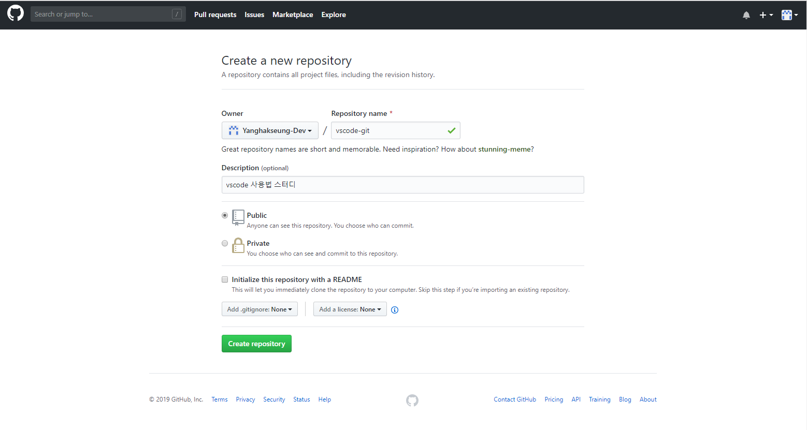
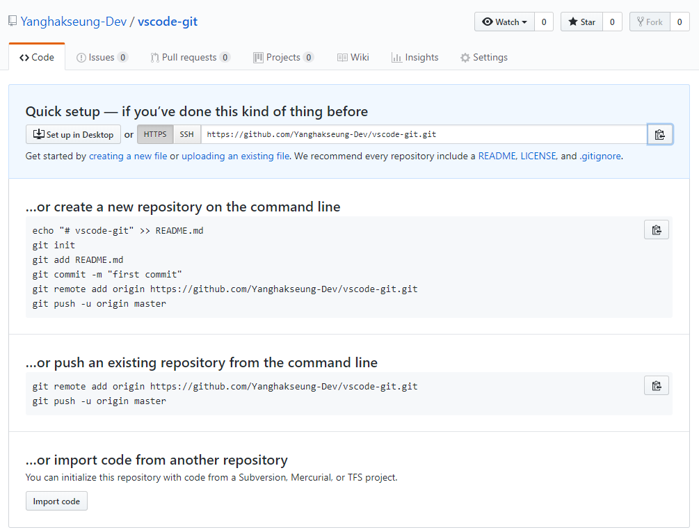
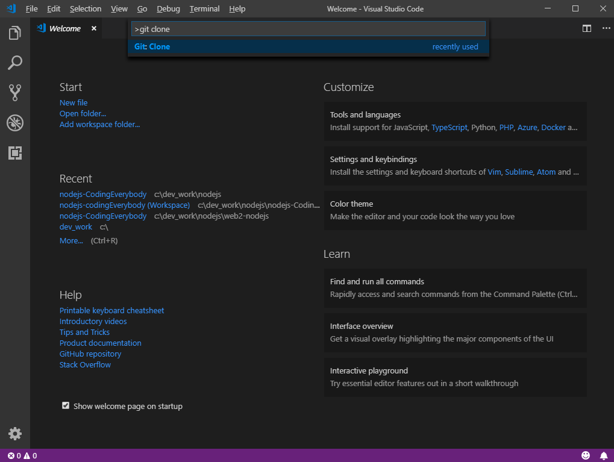
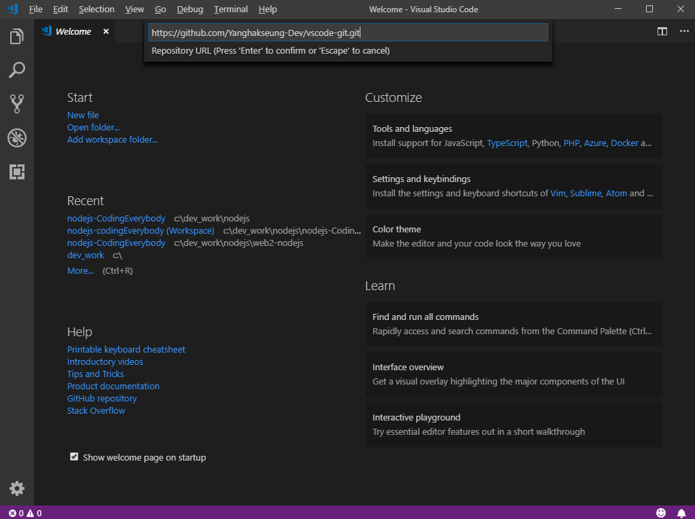
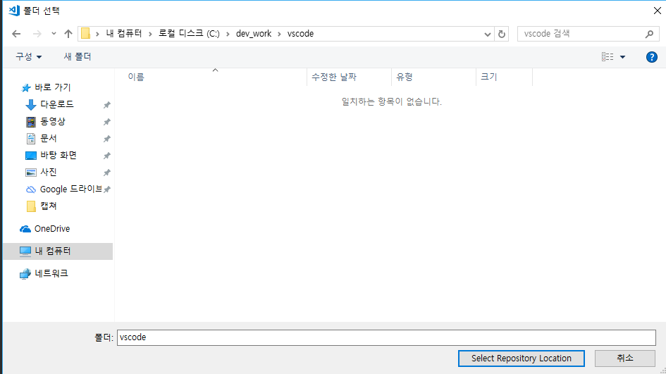
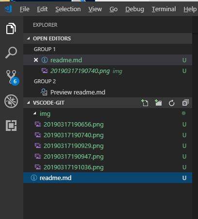
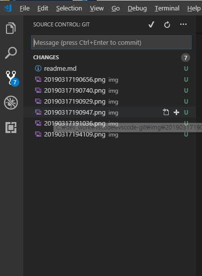
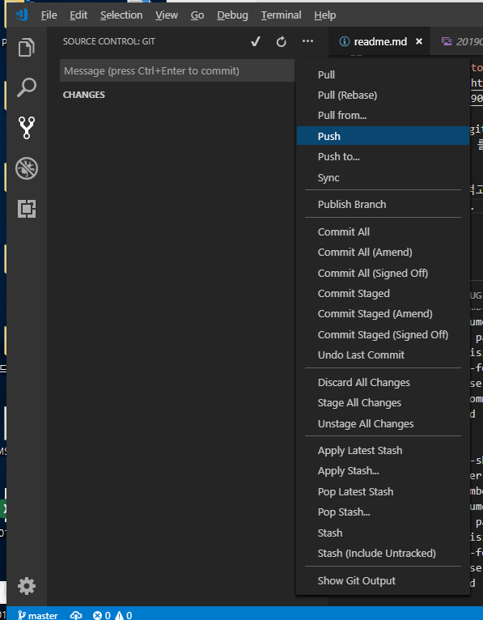
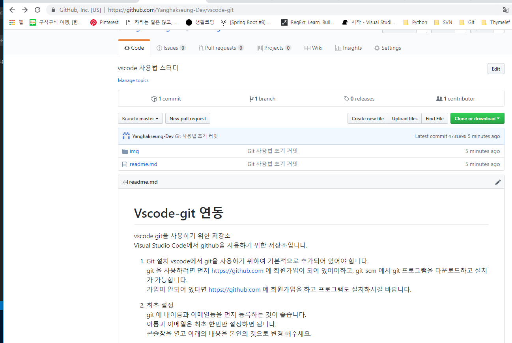
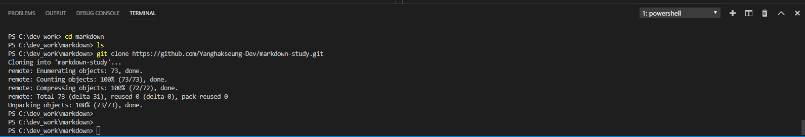

# Vscode-git 연동  

vscode git을 사용하기 위한 저장소  
Visual Studio Code에서 github을 사용하기 위한 저장소입니다.

1. Git 설치 
vscode에서  git을 사용하기 위하여 기본적으로 추가되어 있어야 합니다.  
git 을 사용하려면 먼저 https://github.com 에 회원가입이 되어 있어야하고, git-scm 에서 git 프로그램을 다운로드하고 설치가 가능합니다.  
가입이 안되어 있다면 https://github.com 에 회원가입을 하고 프로그램도 설치하시길 바랍니다.  

2. 최초 설정  
git 에 내이름과 이메일등을 먼저 등록하는 것이 좋습니다.     
이름과 이메일은 최초 한번만 설정하면 됩니다.  
콘솔창을 열고 아래의 내용을 본인의 것으로 변경 해주세요.

```
git config --global user.name "이름"   
git config --global user.email "이메일"
```

3. github 에서 Repository를 생성하기 및 저장소 주소

  
  

4. VSCode에서 git clone 하기  
`ctrl+shift+p` 를 눌러 명령팔렛트를 열어서 `git clone` 를 누릅니다.

 
 
 

5. 커밋하기  
커밋 메시지를 적고, ctrl+Enter 을 눌러도 되고, 상단에 커밋아이콘을 클릭해도 됩니다.




6. 원격 저장소에 push 하기 
push를 선택하고 원격 저장소에 commit 한 부분을 적용 한다.





7. 이미 존재하는 GitHub 저장소가 존재할 경우 연동  
터미널 창으로 이동하여 아래와 같이 git clone 명령어로 해당 정보를 가져온다.

```
git clone https://github.com/Yanghakseung-Dev/markdown-study.git
```

